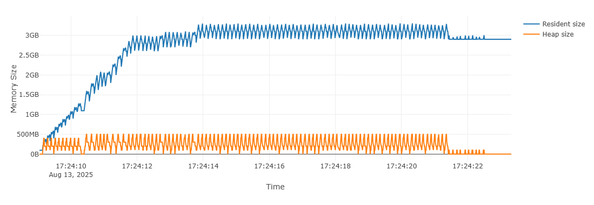
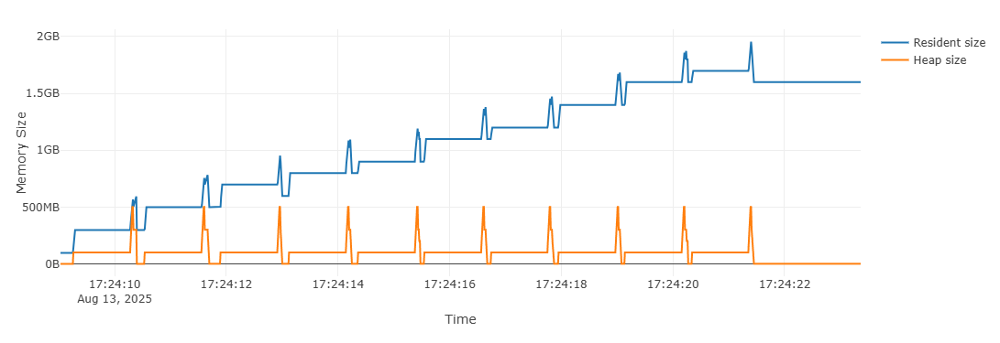
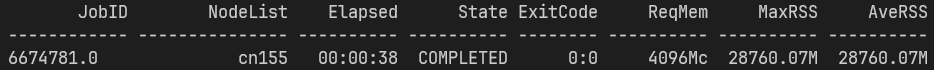

# Ray OOM on SLURM
An example project to show how the OS reports memory usage in Ray applications. This was made while facing OOM errors
when running on a SLURM cluster. Memory usage is tracked using Ray's internal memory monitoring, psutil, and memray.

__TL;DR, The OS shows high total RSS due to duplicate reports of shared memory usage
across processes. For example, 2 processes sharing 10MB of memory will report 10MB of RSS each, totaling 20MB of RSS.__

## Experiment Design
The main process spawns 1 server and __n__ clients, each as Ray actors running on independent processes. The server has 
two tasks:

- Send arrays to clients.
- Receive arrays from clients.

The server will first send a unique array to each client asynchronously for the clients to process. When a client
responds, the server will send that client a new unique array. This repeats until a certain number of rounds have
passed.

Clients only do one thing. They receive arrays from the server, process them (sleep for 1 second), then send back a new
array.

The main process will wait for the system to complete a certain number of rounds by polling the status of the server.
The main process and the server share a _RemoteFlag_ (defined in `flag.py`), which is basically just a binary semaphore.

## Memory Profiling
There are five ways to profile memory usage, Ray's memory monitor logs, `ray memory`, psutil, memray, and htop.

- Memory logs: Ray will report its object store usage in `tmp/ray/session-latest/logs/monitor.log`, assuming that your
tmp directory for ray is set to `tmp/ray`. In that log file, search for __object_store_memory__.
- `ray memory`: This is Ray's internal memory profiling tool. It will show a more detailed look into all current
handles in the object store while the Ray application is running.
- psutil: Queries system info. In this application, we track RSS, USS, PSS, and SHR (shared memory). Each process
(server, clients, main) are tracked independently and the peak usage is stored. The peak memory usage for each process is
printed to stdout along with a total sum of everything.
- memray: Tracks memory allocations. Similarity to psutil, each process is tracked independently except only one client
is tracked. This is because there are usually a lot of client processes and only tracking one is sufficient for
understanding its memory allocation patterns since all clients do the same thing.
- htop: Just htop. Look at RES and SHR.

## Requirements
- ray
- psutil
- memray
- python 3.9+? (tested on 3.12)

## How to Run
Install dependencies with
```
pip install -r requirements.txt
```

Then run
```
python main.py
```

Tags:
- `--ray_tmp`: Tmp path for ray. Must be an absolute path. default="<cwd>/tmp/ray"
- `--mray_dir`: Path to store memray results. The directory must be empty. default="./memray"
- `--array_size`: Size of transfer array in bytes. default=100000000 (100MB).
- `--obj_store_mem`: Size of ray object store. Ray recommends 30% of total memory. default=10000000000 (10GB).
- `--timeout`: How long the main process will wait for the server to finish in seconds. default=1000.
- `--poll_int`: Polling interval for the main process to check on the server status in seconds. default=1.
- `--clients`: Number of clients. Make sure you have enough CPUs for each client (1/client and 1 for the server). default=10.
- `--rounds`: Number of rounds. default=20.

Finally, run
```
./memray_gen_prof.sh ./memray/
```
to generate html reports that can be opened in your browser. (Change ./memray/ to wherever you saved the results)

## Example
This was project was originally made to debug OOM errors on SLURM, so that is what we will be looking at. When running
the program with 10 clients, 100MB arrays, and 20 rounds (the default settings), we get the following printed to the
terminal (with some stuff omitted):

```
Process: Server peak usage
    RSS: 3104.45 MB
    USS: 327.41 MB
    PSS: 1390.47 MB
    SHR: 2838.50 MB

Process: Client 0 peak usage
	RSS: 1999.39 MB
	USS: 363.28 MB
	PSS: 480.84 MB
	SHR: 1738.01 MB

...

Total memory report after all tasks completed
	RSS: 27807.37 MB
	USS: 3878.35 MB
	PSS: 6761.89 MB
	SHR: 24857.54 MB
```

Here we see a large amount of peak SHR usage (remember that there are 10 clients total), with the total SHR being
25GB. This also causes a high total RSS of 28GB since RSS includes the shared memory usage. But, we also see that USS
and PSS reports are much lower. USS and PSS are a better representation of the total memory usage for the application
since they do not include duplicate reports of shared memory across processes.

We can also look at the Ray memory monitor logs to see that only around 1GB of shared memory is actually in use, which
makes sense because the server has 10 clients to send 100MB arrays to.

```
Resources
---------------------------------------------------------------
Total Usage:
 11.0/64.0 CPU
 0B/969.57GiB memory
 953.67MiB/9.31GiB object_store_memory
```

Additionally, we see that the shared memory usage for the server and clients are higher than expected. Looking at the
server (top) and client 0 (bottom) memray flamegraphs, we see that heap usage is stable and somewhat matches expectation, but RSS
continues to grow.




The psutil metrics prove that most of the RSS is coming from shared memory usage (Ray's object store).
Whenever a processes uses shared memory, its reported usage goes up. Again, this is a problem because it lead to
duplicate reports of shared memory across processes, leading to the high peak RSS report despite only 1GB of shared
memory actually being used.

When we run this program as a slurm batch job, we get a MaxRSS of 28.8GB, close to the psutil reported total RSS.



Overall, we see that duplicated and inaccurate reports of shared memory usage across multiple processes lead to an
inflated max RSS. This is a problem because slurm, in our case, flags OOM based on the max RSS.
